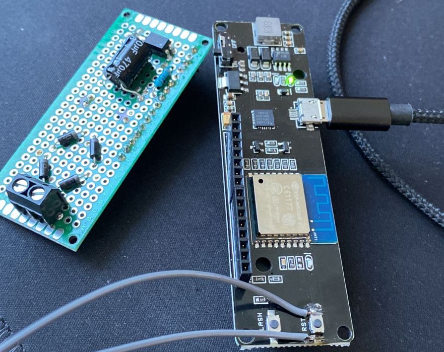
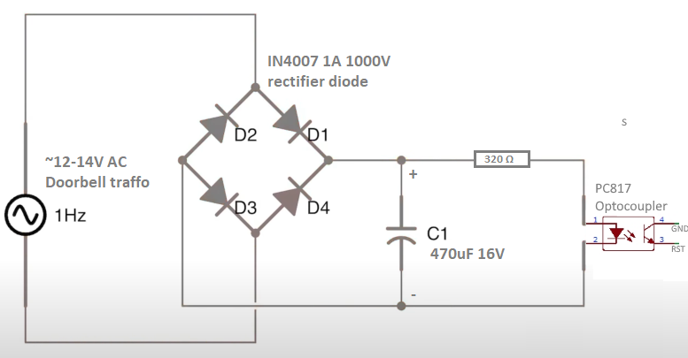

# EspSmartSipDoorbel
ESP8266 based doorbell ringing Fritzbox DECT phones via SIP protocol (like Fritzbox)  
with MQTT support to integrate into home assistant, io broker or any other smart home solution.



## Hardware Components

- 1x [WeMos D1 ESP-Wroom-02 ESP8266 Wifi Bord with 18650 Battery PWM I2C](https://de.aliexpress.com/item/1005001676660492.html)
- 1x [18650 3.7V 3400mAh Li-Ion Battery](https://www.akkuteile.de/en/panasonic-ncr18650b-3-6v-3-7v-3400mah-li-ion-battery-positive-terminal-flat_100639_1240)
- 4x [IN4007 DO-41 rectifier diode 1A 1000V](https://www.amazon.de/gp/product/B01F4SQ6KU)
- 1x [470uF 16v 8x12 electrolytic capacitor](https://www.amazon.de/gp/product/B07NP76TYN)
- 1x [320 Ohm resistor](https://www.amazon.de/dp/B07Q87JZ9G)
- 1x [PC817 Optocoupler](https://www.amazon.de/gp/product/B08TWDFHNX)
- 1x [Breadboard](https://www.amazon.de/gp/product/B0734XYJPM)

### 12V AC Doorbell to ESP8266 deep sleeping reset button

Basically it's easy: Connect your doorbell (left), convert AC to DC (middle) and reset the ESP8266 when doorbell rings (right).
  

There's a lot of different hardware solutions, that's just the one that works for me. You can use the samecode and trigger the ESP reset in a bunch of different ways.

## Home Assistant Event Configuration

Here's my example configuration for home assistant, to react to doorbell with a critical alert to my smartphone:  

```yaml
alias: Doorbell(Stefan)
description: ''
trigger:
  - platform: mqtt
    topic: homeassistant/home/doorbell
    payload: 'ON'
condition:
  - condition: state
    entity_id: person.stefan
    state: home
action:
  - service: notify.mobile_app_stefansIphone
    data:
      message: It's ringing!
      title: Doorbell
      data:
        push:
          sound:
            name: default
            critical: 1
            volume: 1
mode: single
```

## Credits
- Project inspired by [Konrad Elektronik](https://www.reichelt.de/magazin/how-to/smarte-tuerklingel/)  
- Working source code based on https://www.mikrocontroller.net/topic/444994  
- Rectifier inspired by [AEQ-WEB](https://www.youtube.com/watch?v=zPAFFSmmZXU&t=294s)  

